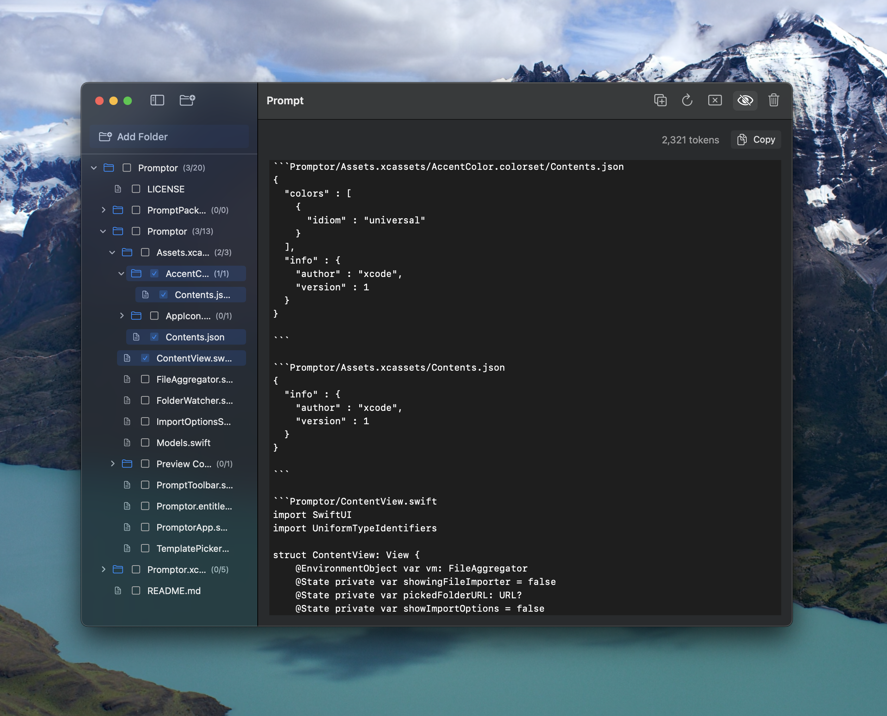

# Promptor

**Turn any codebase into a single, clean prompt – in seconds.**

<p align="center">
  
</p>

[📺 **Live 20-second demo on X**](https://x.com/edrick_dch/status/1919219856320160161)


[](https://twitter.com/edrick_dch)

---

Promptor is a tiny macOS app that lets you _drag-in_ a folder and _drag-out_ a perfectly-formatted prompt ready for ChatGPT (or any LLM).  

No server-side processing, no API keys, no rate limits – just a local SwiftUI app that gives you the full context of your project in one click.

> “I built Promptor after realising I was paying US $0.30 per O3 request in Cursor. With ChatGPT Plus I already get 100 O3 requests every week… so why not copy the entire repo into the chat? Promptor is that copy-and-paste button.” – [@edrickdch](https://github.com/edrickdch)

---

## ✨ Key Features

* **One-click import** – choose any folder; Promptor filters out binaries, images, build artefacts, etc.  
* **Smart ignore rules** – defaults modelled after `.gitignore` + binary/media filters; adjustable before every import.  
* **Folder-aware selection** – recursively include/exclude sub-trees with a single checkbox; selection counts update live.  
* **Live token counter** – rough GPT-token estimate so you know when to stop adding files.  
* **Template system** – swap between `Default`, `ChatML`, or roll your own with `{{files}}` placeholder.  
* **Security-scoped bookmarks** – full sandbox compliance; Promptor never uploads or phones home.  
* **Zero dependencies** – pure Swift + SwiftUI, 100 % local.

---

## 🚀 Quick Start

### 1. Clone & open

```bash
git clone https://github.com/edrickdch/Promptor.git
open Promptor/Promptor.xcodeproj   # or .xcworkspace if you add packages
```

### 2. Build

* Xcode 15 or newer
* macOS 14 (Sonoma) SDK

Press `⌘R` to run. The first time you import a folder macOS will ask for permissions; Promptor stores a security-scoped bookmark so you don’t have to re-grant every launch.

### 3. Use

1. **Add Folder** → pick your repo
2. (Optional) tweak ignore suffixes / folders
3. Check the files or folders you want
4. Copy → paste into ChatGPT (or anywhere)

Done.

---

## 🔧 Advanced

| Setting             | Location                  | Default                     |
| ------------------- | ------------------------- | --------------------------- |
| Include sub-folders | Import sheet              | ✅                           |
| Ignore suffixes     | Import sheet (comma-sep)  | `.png,.jpg,.zip,…`          |
| Ignore folders      | Import sheet (comma-sep)  | `node_modules,build,.git,…` |
| Max file size       | `AppSettings.maxFileSize` | `500 KB`                    |

Edit [`Models.swift`](Promptor/Models.swift) to change globals.

---

## Why Use Promptor?

1. Simple & Easy to Use
2. Open Source
3. Free

---

## 🤝 Contributing

PRs welcome! Please open an issue first if you’re planning a major change.

```bash
git checkout -b feature/your-awesome-feature
git commit -m "Add amazing thing"
git push origin feature/your--awesome-feature
```

---

## 📝 License

MIT © 2025 Edrick Da Corte Henriquez. See [`LICENSE`](LICENSE) for details.

---
